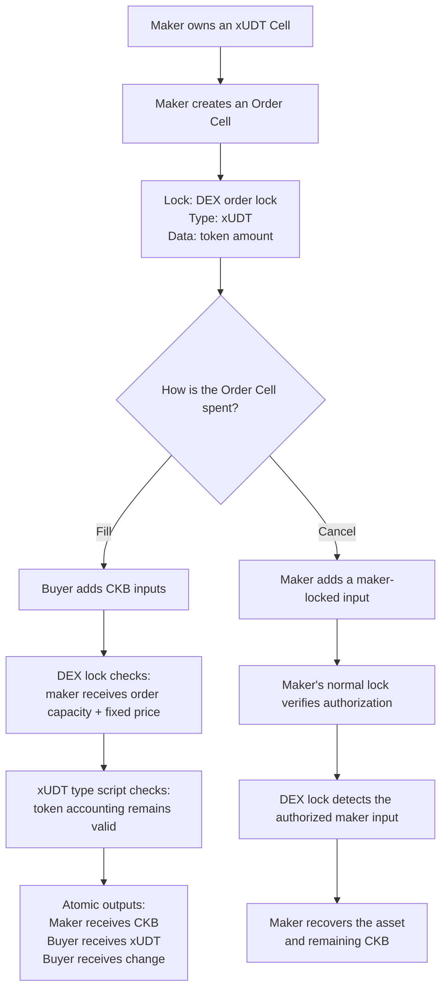
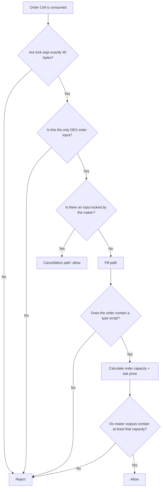

# Fixed-Price DEX V1 Design

## Implementation Schedule

- **Week 9:** Design, contract setup, argument encoding and decoding
- **Week 10:** Settlement, cancellation, safety checks, and complete tests

This document is the single source of truth for the complete V1 contract. The
implementation is intentionally divided across two weeks.

## The Contract in One Sentence

A typed asset Cell can be spent either by a buyer who pays the maker the fixed
price plus the Cell's locked capacity, or by the maker who authorizes a
cancellation.

## Scope

This first version supports:

- One maker selling one typed asset, intended to be an xUDT
- Payment in CKB
- One fixed ask price
- Full fills only
- One DEX order per transaction
- Maker-authorized cancellation

It does not support partial fills, order matching, fees, liquidity pools,
variable pricing, or token-to-token swaps.

## Main Flow



Creating an Order Cell does not execute its lock script. The DEX lock runs when
the Order Cell is later consumed.

## The Actors

### Maker

The maker owns the asset, chooses the fixed price, creates the Order Cell, and
may cancel an unfilled order.

### Buyer

The buyer discovers the Order Cell and constructs a transaction that pays the
maker. The buyer chooses the lock for the new token Cell.

The buyer does not need permission from the maker because the order itself is
the maker's standing offer.

## The Order Cell

| Part      | Meaning                                    | Source of truth       |
| --------- | ------------------------------------------ | --------------------- |
| Capacity  | CKB locked as storage for the order        | The Order Cell itself |
| Lock      | The fixed-price DEX rules                  | DEX order lock script |
| Type      | Identity and accounting rules of the asset | xUDT type script      |
| Data      | Amount of the asset                        | xUDT data             |
| Lock args | Maker identity and fixed price             | DEX lock args         |

The DEX lock does not duplicate the token ID or token amount. Those already
belong to the xUDT type script and Cell data.

## Lock Arguments

The lock arguments contain exactly two values:

| Field           |     Size | Meaning                                                     |
| --------------- | -------: | ----------------------------------------------------------- |
| Maker lock hash | 32 bytes | Identifies the maker's lock script                          |
| Ask price       |  8 bytes | Fixed CKB price in shannons, encoded as little-endian `u64` |

Total argument length: **40 bytes**.

The ask price is the sale price only. The order's locked capacity is returned
to the maker in addition to this price.

```text
required maker capacity = order input capacity + ask price
```

This avoids treating the order's storage deposit as part of the sale price.

## Fill Transaction

```text
INPUTS                              OUTPUTS

Order Cell                          Token Cell for buyer
- DEX lock                          - buyer lock
- xUDT type                         - same xUDT type
- token amount                      - token amount
- order capacity

Buyer CKB Cell(s)                   Maker payment Cell(s)
                                    - maker lock
                                    - order capacity + ask price

                                    Buyer CKB change
```

The responsibilities are deliberately separated:

| Component           | Responsibility                                 |
| ------------------- | ---------------------------------------------- |
| DEX order lock      | Ensure the maker receives enough CKB           |
| xUDT type script    | Enforce token accounting                       |
| Buyer's normal lock | Authorize spending the buyer's CKB inputs      |
| Transaction builder | Choose the buyer's token output and CKB change |

The trade is atomic because payment and token movement are outputs of the same
transaction. Either the complete transaction passes every script or none of it
is accepted.

## Cancellation Transaction

```text
INPUTS                              OUTPUTS

Order Cell                          Recovered token Cell
- DEX lock                          - maker lock
- xUDT asset                        - same xUDT asset

Maker authorization Cell            Maker CKB change
- maker's normal lock
```

No custom DEX witness or cancellation flag is needed.

The DEX lock looks for an input whose lock hash matches the maker lock hash from
the order args. That input's own lock script verifies the maker's signature.
The DEX contract therefore composes with the maker's existing lock instead of
implementing signature verification itself.

## Validation Decision



The addition of order capacity and ask price must reject numeric overflow.

Cancellation is checked before the typed-asset requirement. This ensures that
the maker can recover an order that was accidentally created without a type
script. The maker input's own lock script still has to authenticate the
cancellation transaction.

## Why Only One DEX Order per Transaction?

If several orders were allowed, the same maker payment output might be counted
by more than one order script. Correct batch settlement would require grouping
orders and payments carefully.

Version 1 avoids that entire class of accounting bugs by allowing exactly one
DEX order input per transaction.

## Single Sources of Truth

| Fact                       | Only source                      |
| -------------------------- | -------------------------------- |
| Maker identity             | Maker lock hash in DEX lock args |
| Fixed price                | Ask price in DEX lock args       |
| Offered asset              | Order Cell's type script         |
| Offered amount             | Order Cell's data                |
| Storage deposit            | Order input capacity             |
| Cancellation authorization | A real maker-locked input        |
| Token conservation         | xUDT type script                 |

The price is not copied into Cell data or a witness. The token amount is not
copied into the DEX args. Cancellation does not introduce a second
authentication system.

## What the DEX Lock Does Not Need to Know

The lock does not need to:

- Verify the maker's signature itself
- Maintain a global order book
- Search for a buyer
- Store the buyer's identity
- Calculate an exchange rate
- Manage token supply
- Hold pooled liquidity

These exclusions are intentional. The contract has one job: safely settle or
cancel a fixed-price order.

## Week 9 Definition of Done

Week 9 is complete when:

1. The fixed-price DEX flow and responsibilities are documented.
2. The `dex-order-lock` contract is generated and builds successfully.
3. The 40-byte lock argument layout is defined.
4. The maker lock hash is decoded from the first 32 bytes.
5. The little-endian ask price is decoded from the final 8 bytes.
6. A valid-arguments test passes.
7. The remaining V1 settlement work is documented for Week 10.

## Week 10 Test Checklist

- A correctly paid order succeeds
- Payment below `order capacity + ask price` fails
- Payment sent to the wrong lock fails
- A cancellation with a maker-authorized input succeeds
- A cancellation attempt without maker authorization fails
- Malformed lock arguments fail
- An order without a type script fails
- A transaction containing multiple DEX order inputs fails
- Capacity addition overflow fails safely

## V1 Contract Definition of Done

The complete V1 contract is done when:

1. The design above is implemented without adding new features.
2. Every checklist case has a passing test.
3. The successful fill and cancellation cycle counts are recorded.
4. The contract README explains the same rules without contradicting this file.
